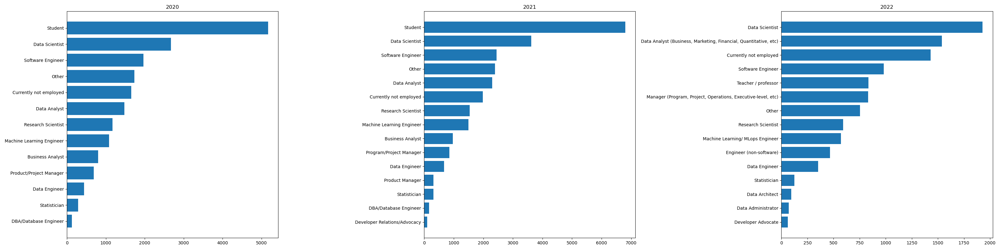
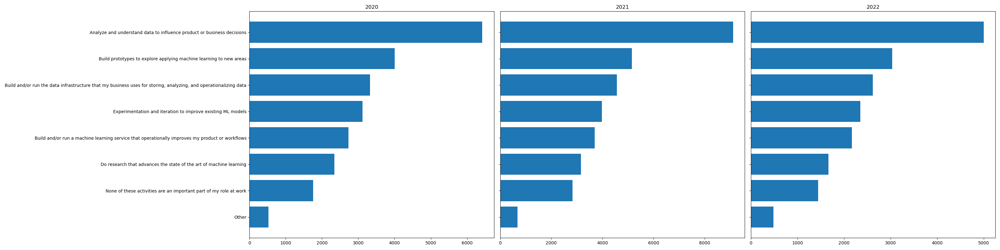
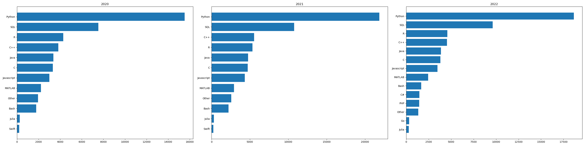
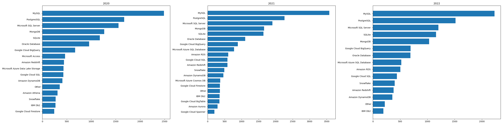
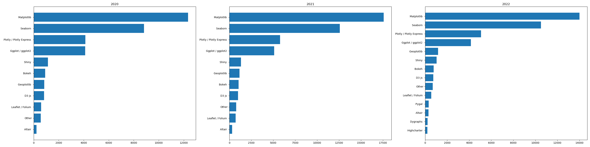
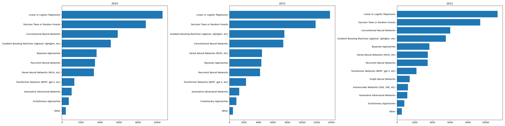

# 練習專案3：資料科學家的工具箱

## 簡介
這個專案「資料科學家的工具箱」透過 2020、2021 與 2022 年 kaggle.com 所舉辦的 Kaggle Machine Learning and Data Science Survey 普查問卷進行縱貫研究，針對下列三個常見初學者問題進行探索性分析。

1. 從事資料科學工作的職缺抬頭（title）有哪些？
2. 從事資料科學工作的日常內容是什麼？
3. 想要從事資料科學工作，需要具備哪些技能與知識？
 
我們使用了 `pandas` 與 `sqlite3` 建立了資料庫，利用 `matplotlib` 進行概念驗證並做出成品。

## 如何重現
安裝 Miniconda
依據 `environment.yml` 建立環境：

```bash
conda env create -f environment.yml
```

將 `data/` 資料夾中的 `kaggle_survey_2020_responses.csv`, `kaggle_survey_2021_responses.csv`, `kaggle_survey_2022_responses.csv` 置放於工作目錄中的 `data/` 資料夾。
啟動環境並執行 `python create_kaggle_survey_db.py` 就能在 `data/` 資料夾中建立 `kaggle_survey.db`
啟動環境並執行 `python create_longitudinal_analysis_plots.py` 就能輸出六組水平長條圖。


### 從事資料科學工作的職缺抬頭（title）有哪些？



### 從事資料科學工作的日常內容是什麼？



### 想要從事資料科學工作，需要具備哪些技能與知識？







